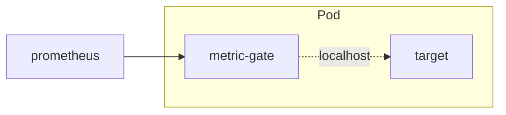
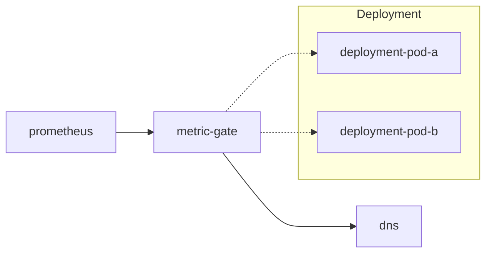
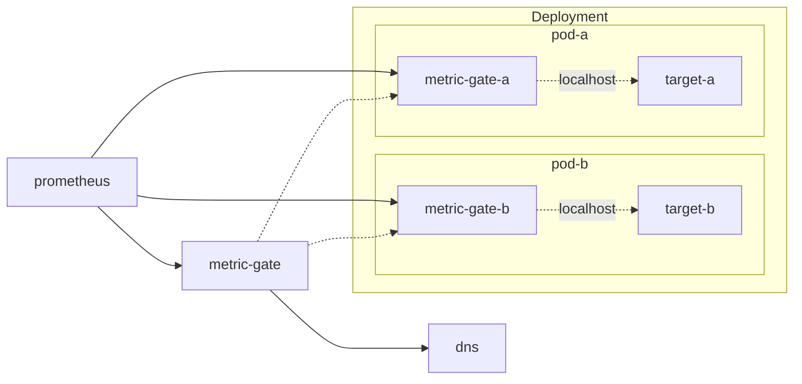

# metric-gate
A Prometheus scrape proxy that can filter and aggregate metrics at the source, reducing cardinality before ingestion.

- Filtering is done using [metric_relabel_configs](https://prometheus.io/docs/prometheus/latest/configuration/configuration/#relabel_config).
- Aggregation is done via `labeldrop` leading to `sum() without(label)` like result. Note, that it works for Counters and Histograms, but has no sense for Gauges.

Could be used in three modes:
- [sidecar](#sidecar-mode), as a container in the same pod with a single target (as above)
- [dns](#dns-mode), returns aggregated result of multiple targets
- [subset](#subset-mode) metrics to separate endpoints

### Why?
Consider the following example:

`ingress-nginx` exposes [6 Histograms](https://kubernetes.github.io/ingress-nginx/user-guide/monitoring/#request-metrics) (of 12 buckets each) for each Ingress object. Now suppose you have k8s cluster with 1k Ingresses, each having 10 Paths defined:

Cardinality: 1000 ingresses * 6 histogram * 12 buckets * 10 path = 720k metrics

The resulting size of http response on `/metrics` endpoint is 276Mb. Which is being pulled by Prometheus every scrape_interval (default 15s) leading to constant ~40Mbit/s traffic (compressed) on each replica of ingress-nginx Pod.

Sure, metrics could be filtered at Prometheus side in `metric_relabel_configs`, but it will not reduce the amount of data being pulled from target. And then aggregation could be done via `recording rules`, but one cannot drop already ingested source data afterward.

### sidecar mode
In this case, `metric-gate` could be used as a sidecar container, which would get original metrics via fast `localhost` connection, apply filtering and aggregation, and then return smaller response to Prometheus.

Let's reduce cardinality 10x by removing `path` label from `ingress-nginx` metrics above:

```ini
# before
metric{ingress="test", path="/api", ...} 5
metric{ingress="test", path="/ui", ...} 2

# after
metric{ingress="test", ...} 7
```
That could be done via dropping the label from all the metrics:
```yaml
metric_relabel_configs:
- action: labeldrop
  regex: path
```
Or, you can target specific metrics by setting label to empty value:
```yaml
metric_relabel_configs:
- action: replace
  source_labels: [ingress, __name__]
  regex: test;metric
  target_label: path
  replacement: "" # drops the `path` label
```

Usual filtering is also works.  
Example of dropping all histograms except when `status="2xx"`:
```yaml
metric_relabel_configs:
- action: drop
  source_labels: [status, __name__]
  regex: "[^2]xx;nginx_ingress_controller_.*_bucket"
```

### dns mode
When you prefix `--upstream` scheme with `dns+` (as in [thanos](https://thanos.io/tip/components/query.md/)) and set it to dns name which resolves to multiple IPs, `metric-gate` will return aggregated metrics from all the targets.

In k8s you can use [headless Service](https://kubernetes.io/docs/concepts/services-networking/service/#headless-services) to expose all the Pods IPs for some LabelSelector:
```yaml
apiVersion: v1
kind: Service
metadata:
  name: ingress-nginx-controller-metrics
spec:
  clusterIP: None # headless Service
  selector:
    app.kubernetes.io/name: ingress-nginx
  publishNotReadyAddresses: true # try to collect metrics from non-Ready Pods too
```

When request comes to `/metrics` endpoint of `metric-gate`, it (re)resolves `--upstream` dns to a set of IPs and fan out to all of them at the same time, so the result is returned with the speed of the slowest target. Timeout of those subrequests is configurable via `--scrape-timeout` flag. With it, you can choose to fail the whole scrape if one of the targets is slow (`--scrape-timeout` > prometheus `scrape_timeout`) , or return partial response with only metrics from the ones that are available in time.

Continuing with our example above, this way you can reduce cardinality to the number of `ingress-nginx-controller` replicas.
To do that, disable direct scrape of each replica Pod by Prometheus, and scrape only `metric-gate` instead.  

Problems with this approach:
- In this mode `/source` endpoint returns single random upstream IP output.
- There is "automatic availability monitoring" based on [up](https://prometheus.io/docs/concepts/jobs_instances/#automatically-generated-labels-and-time-series) metric in Prometheus, which can detect when specific Target is down. In this case it only provides status of `metric-gate` itself, not the each `ingress-nginx-controller` replica.
- All the metrics are aggregated from all the replicas, so information like `process_start_time_seconds` which only makes sense for single replica is not available anymore.
- "Counter resets" detection is broken in the case of aggregation. Consider this example:

  |                     | t1  | t2     | t3  |
  |---------------------| --- |--------| --- |
  | `metric{instance="a"}` | 10  | 10     | 10  |
  | `metric{instance="b"}` | 20  | 0      | 0   |
  | `sum(rate(metric))` | 0   | 0      | 0   |
  | `metric` aggregated | 30  | 10     | 10  |
  | `rate(metric)`      | 0   | 10/15s | 0   |
  
  There are two pods (`a` and `b`) serving `metric` counter. At point in time `t2` we restart pod `b`. This works fine in prometheus, see [Rate then sum](https://www.robustperception.io/rate-then-sum-never-sum-then-rate/), as first `rate` is calculated and it sees drop of counter to 0. This leads to correct 0 result. Now we aggregate those two metrics into one (dropping `instance` label), and at point in time `t2` the value is 10. For `rate` that means that Counter reset happened (value of Counter is less than previous one) and now the value is 10, which reads as "in a scrape interval (15s) it dropped to 0 and then increased to 10", so `rate=10/15s=0.67/s` which is incorrect.

Some of these issues could be solved by `subset` mode, read below.

### subset mode
This allows splitting single `origin` scrape output into multiple endpoints, each with a different set of metrics.

Take again our Ingress example above. [Docs](https://kubernetes.github.io/ingress-nginx/user-guide/monitoring/#exposed-metrics) assign metrics to the following groups:
- `Request metrics`, this is the main number of series on each replica (~720k). We want to aggregate them across all the replicas.
- `Nginx process metrics` and `Controller metrics`, 68 metrics in total. These only have sense for each specific replica.

To aggregate the first and directly scrape the second, we can stack `sidecar` and `dns` modes together:


Let's take a look at the `metric-gate-a` configuration in this case:
```yaml
  containers:
    - name: metric-gate
      image: sepa/metric-gate
      args:
        - --port=8079
        - |
          --relabel=
            metric_relabel_configs:
            - action: keep # drop Request metrics
              source_labels: [__name__]
              regex: (go|nginx_ingress_controller_nginx_process|process)_.*
            requests:
            - action: drop # keep only Request metrics
              source_labels: [__name__]
              regex: (go|nginx_ingress_controller_nginx_process|process)_.*
            - action: labeldrop
              regex: path # aggregate path
```
This way Prometheus scrapes usual `/metrics` endpoint, which is configured by `--relabel`, and has only per-process metrics.
While answering to this request, `metric-gate` uses the same upstream response to fill out all the configured `subsets`.
In this case only one `subset` named "requests" is configured, which results then could be accessed at `/metrics/requests` endpoint.
Now downstream aggregating `metric-gate` could use it to get only `Request metrics` from each replica.

Note that data on `/metrics/requests` is available immediately, and accessing it does not generate new subrequest to the upstream. That is done to reduce both cpu/network load to upstream. But it also means, the data could be stale (it only refreshes on `/metrics` scrapes). To prevent time skew on graphs, `timestamp` of upstream request is added to all the metrics returned by `subset` endpoints (if they don't have it yet)

The diagram above is just one of the examples. We can drop `metric-gate` sidecars, and scrape metrics from Targets directly by Prometheus and aggregating `metric-gate` (each filtering own subset of metrics in `metric_relabel_configs`). That would lead to two scrapes per-scrape-interval, and twice as much cpu/network load on each replica just from a metrics collection. Sidecars are shown here to demonstrate that we can aggregate pre-filtered results, while having a single scrape for Targets.

### Usage
Available as a [docker image](https://hub.docker.com/r/sepa/metric-gate):
```
$ docker run sepa/metric-gate -h
Usage of /metric-gate:
  -f, --file string               Analyze file for metrics and label cardinality and exit
      --log-level string          Log level (info, debug) (default "info")
  -p, --port int                  Port to serve aggregated metrics on (default 8080)
      --relabel string            Contents of yaml file with metric_relabel_configs
      --relabel-file string       Path to yaml file with metric_relabel_configs (mutually exclusive)
  -t, --scrape-timeout duration   Timeout for upstream requests (default 15s)
  -H, --upstream string           Source URL to get metrics from. The scheme may be prefixed with 'dns+' to resolve and aggregate multiple targets (default "http://localhost:10254/metrics")
  -v, --version                   Show version and exit
```
Run it near your target, and set `--upstream` to correct port.  

[metric_relabel_configs](https://prometheus.io/docs/prometheus/latest/configuration/configuration/#relabel_config) could be provided via 2 methods:
- via configMap and `--relabel-file` flag with a full path to the file
- via `--relabel` flag with yaml contents like so:
    ```yaml
    # ... k8s pod spec
    containers:
    - name: metric-gate
      image: sepa/metric-gate
      args:
        - --upstream=localhost:8081/metrics
        - |
          --relabel=
            metric_relabel_configs:
            - action: labeldrop
              regex: path
    # ...
    ```
Any additional keys (to `metric_relabel_configs`) defined in `--relabel=` would be used as a name to access its filtered metrics via `/metrics/<name>` endpoint.

Available endpoints:


To find metrics to aggregate, you can use `/analyze` endpoint:
```
109632 nginx_ingress_controller_response_duration_seconds_bucket
  1313 ingress
  656 service
  334 namespace
  15 path
  12 le
  7 method
  5 status [4xx, 2xx, 3xx, 5xx, 1xx]

...
```
It shows the number of series for each metric, and then the number of values for each label. 

You can also run it as a cli-tool to analyze a file with metrics:
```
docker run --rm -v /path/to/metrics.txt:/metrics.txt sepa/metric-gate --file=/metrics.txt
```

### Note about parsing
From performance perspective, `metric-gate` hot path is parsing prometheus text format, do relabel, and then render it back to text format. 
`Relabel` and `rendering` implementations from prometheus libs look fine, but `parsing` seems as something that could be improved. 
Here is a go bench for different parsing implementations:
```
$ make bench
goos: darwin
goarch: arm64
pkg: github.com/sepich/metric-gate
BenchmarkParseLine0-16      232239      5100 ns/op      9184 B/op     110 allocs/op
BenchmarkParseLine1-16      983380      1246 ns/op      3120 B/op      11 allocs/op
BenchmarkParseLine-16      2222438       539.5 ns/op    1456 B/op       8 allocs/op
BenchmarkParseLine2-16     2635765       458.3 ns/op    1408 B/op       6 allocs/op
BenchmarkParseLine3-16     1817930       659.9 ns/op    1832 B/op      26 allocs/op
BenchmarkParseLine4-16     2623164       453.5 ns/op    1408 B/op       6 allocs/op
```
where:
- ParseLine0 uses prometheus `expfmt.TextToMetricFamilies`
- ParseLine1 uses prometheus `textparse.PromParser`
- ParseLine previous custom implementation
- ParseLine2 AI improved version of it for speed (to the state of being unreadable)
- ParseLine3 attempt to use raw `[]byte` instead of `string` to skip utf8, but `Label` conversion to `string` is more expensive
- ParseLine4 attempt to use state-machine with only pointers to a slice (used now)

So the custom implementation is >2x faster than using prometheus lib. And actual algorithm does not matter much, the number of mem allocations per line is more important.

### Alternatives
- [vmagent](https://docs.victoriametrics.com/victoriametrics/stream-aggregation/) can do aggregation to new metric names and then send remote-write to Prometheus.  
How to relabel metrics to the original form?
Possibly use `vmserver` instead of `vmagent`, to scrape `/federate` endpoint instead of remote-write, to allow for relabeling in scrape config on prometheus side
- [otelcol](https://github.com/open-telemetry/opentelemetry-collector-contrib/issues/4968#issuecomment-2148753123) possible, but needs relabeling on the prometheus side to have metrics with original names
- [grafana alloy](https://grafana.com/docs/alloy/latest/reference/components/otelcol/otelcol.processor.transform/) same as otelcol
- [exporter_aggregator](https://github.com/tynany/exporter_aggregator) scape metrics from a list of Prometheus exporter endpoints and aggregate the values of any metrics with the same name and labels. Same as `dns` mode, but with static list of upstreams
- [telegraf](https://docs.influxdata.com/telegraf/v1/aggregator-plugins/merge/) and [vector](https://vector.dev/docs/reference/configuration/transforms/aggregate/#aggregation-behavior) cannot aggregate metrics like `sum() without(label)`, it is more like downsampling
