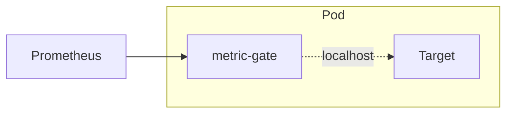

# metric-gate
A Prometheus scrape proxy that can filter and aggregate metrics at the source, reducing cardinality before ingestion.

- Filtering is done using [metric_relabel_configs](https://prometheus.io/docs/prometheus/latest/configuration/configuration/#relabel_config).
- Aggregation is done via `labeldrop` leading to `sum() without(label)` like result. Note, that it works for Counters and Histograms, but has no sense for Gauges.

### Why?
`ingress-nginx` exposes [6 Histograms](https://kubernetes.github.io/ingress-nginx/user-guide/monitoring/#request-metrics) (of 12 buckets each) for each Ingress object. Now suppose you have k8s cluster with 1k Ingresses, each having 10 Path defined:

Cardinality: 1000 ingresses * 6 histogram * 12 buckets * 10 path = 720k metrics

The resulting size of http response on `/metrics` endpoint is 276Mb. Which is being pulled by Prometheus every scrape-interval (default 15s) leading to constant ~6Mbps traffic (compressed).

Sure, metrics could be filtered at Prometheus side in `metric_relabel_configs`, but it will not reduce the amount of data being pulled from target. Also, aggregation could be done via `recording rules`, but one cannot drop already ingested data.

In this case, `metric-gate` could be used as a sidecar container, which would get original metrics via fast `localhost` connection, apply filtering and aggregation, and then return smaller response to Prometheus.

### Example
Let's reduce cardinality 10x by removing `path` label from `ingress-nginx` metrics above:

```ini
# before
metric{ingress="test", path="/api", ...} 5
metric{ingress="test", path="/ui", ...} 2

# after
metric{ingress="test", ...} 7
```
That could be done via dropping the label from all the metrics:
```yaml
- action: labeldrop
  regex: path
```
Or, you can target specific metrics by setting label to empty value:
```yaml
- action: replace
  source_labels: [ingress, __name__]
  regex: test;metric
  target_label: path
  replacement: "" # drops the label
```

### Usage
Available as a [docker image](https://hub.docker.com/r/sepa/metric-gate):
```
$ docker run sepa/metric-gate
Usage of /metric-gate:
  -file string
        Analyze file for metrics and label cardinality and exit
  -port int
        Port to serve aggregated metrics on (default 8080)
  -relabel string
        metric_relabel_configs contents
  -relabel-file string
        metric_relabel_configs file path
  -upstream string
        Source URL to get metrics from (default "http://localhost:10254/metrics")
  -version
        Show version and exit
```
Run it near your target, e.g. as a sidecar container. And set `-upstream` to correct port.  
`metric_relabel_configs` could be provided via 2 methods:
- via configMap and `-relabel-file` flag with full path to the file
- via `-relabel` flag with yaml contents like so:
    ```yaml
    # ... k8s pod spec
    containers:
    - name: metric-gate
    image: sepa/metric-gate
    args:
        - -upstream=localhost:8081/metrics
        - |
        -relabel=
            - action: labeldrop
              regex: path
    # ...
    ```        

Available endpoints:


To find metrics to aggregate, you can use `/analyze` endpoint:
```
109632 nginx_ingress_controller_response_duration_seconds_bucket
  1313 ingress
  656 service
  334 namespace
  15 path
  12 le
  7 method
  5 status [4xx, 2xx, 3xx, 5xx, 1xx]

...
```
It shows number of series for each metric, and then number of values for each label. 

You can also run it as a cli-tool to analyze file with metrics:
```
docker run --rm -v /path/to/metrics.txt:/metrics.txt sepa/metric-gate -file=/metrics.txt
```

### Alternatives
- [vmagent](https://docs.victoriametrics.com/victoriametrics/stream-aggregation/) can do aggregation to new metric names and then send remote-write to Prometheus.  
How to relabel metrics to original form?
Possibly use `vmserver` instead of `vmagent`, to scrape `/federate` endpoint instead of remote-write, to allow for relabeling in scrape config on prometheus side.
- [vector.dev](https://vector.dev/docs/reference/configuration/transforms/aggregate/) cannot aggregate metrics like `sum() without(label)`, only filtering.
- [otelcol](https://github.com/open-telemetry/opentelemetry-collector-contrib/issues/4968#issuecomment-2148753123) possible, but need to do relabel on prometheus side to have metrics with original names.
- [grafana alloy](https://grafana.com/docs/alloy/latest/reference/components/otelcol/otelcol.processor.transform/) same as otelcol
- [exporter_aggregator](https://github.com/tynany/exporter_aggregator) scape metrics from a list of Prometheus exporter endpoints and aggregate the values of any metrics with the same name and label/s
